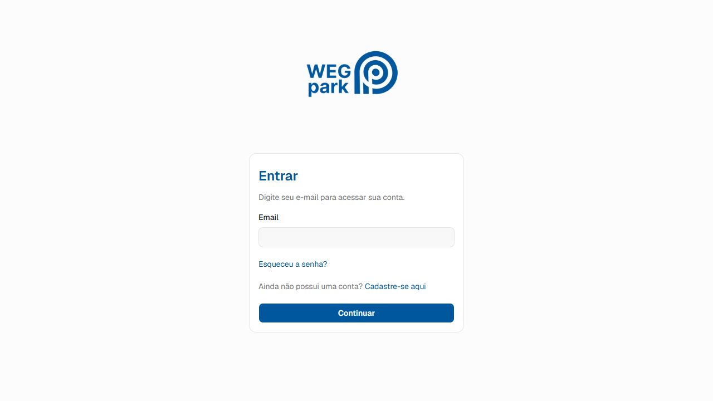
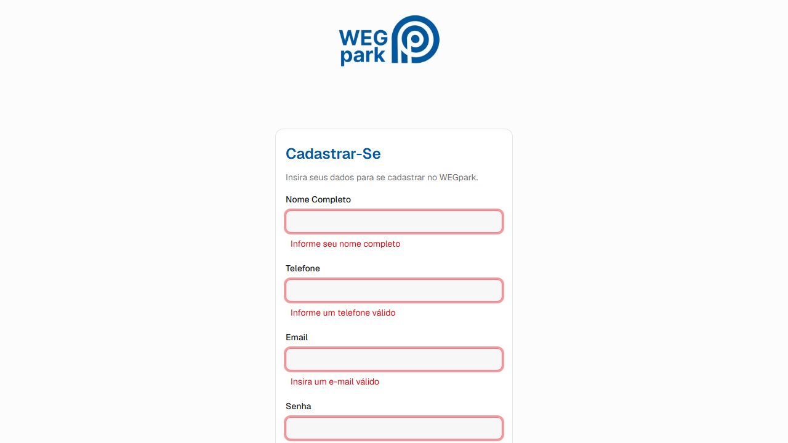
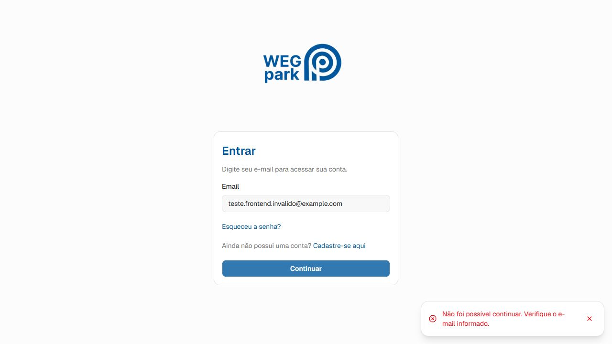
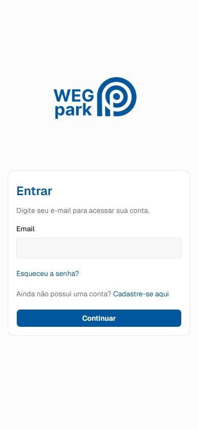

# Testes de interface - WEGpark Front-end

Este documento registra o plano, a execucao e as evidencias dos testes de interface do WEGpark. Os testes autenticados dependem de uma API acessivel e de contas de teste autorizadas; eles nao devem ser marcados como aprovados sem a respectiva evidencia.

## Ambiente de teste

- Aplicacao: front-end WEGpark em `http://localhost:3000`;
- API: URL configurada em `NEXT_PUBLIC_API_URL`;
- Navegadores: versoes atuais do Chrome, Edge ou Firefox;
- Dispositivos: viewport desktop e viewport mobile;
- Responsavel: equipe de front-end.

## Casos de teste

| Codigo | Funcionalidade | Objetivo e etapas resumidas | Resultado esperado | Prioridade |
| --- | --- | --- | --- | --- |
| TC001 | Login valido | Informar credenciais validas e concluir o login. | Sessao iniciada e redirecionamento para a area permitida ao perfil. | Alta |
| TC002 | Login invalido | Informar senha incorreta para uma conta existente. | Acesso bloqueado e mensagem clara, sem detalhes internos da API. | Alta |
| TC003 | Cadastro de veiculo | Abrir veiculos, cadastrar um veiculo valido e retornar a lista. | Novo item exibido e feedback de sucesso apresentado. | Alta |
| TC004 | Validacao de formulario de veiculo | Tentar cadastrar veiculo com campo obrigatorio vazio ou placa invalida. | Envio bloqueado e mensagens de validacao associadas aos campos. | Alta |
| TC005 | Edicao de veiculo | Alterar um campo de veiculo existente e salvar. | Alteracao persistida, mensagem de sucesso e lista atualizada. | Media |
| TC006 | Navegacao por perfil | Acessar todos os itens da sidebar de cada perfil disponivel. | Rotas corretas e somente itens autorizados visiveis. | Alta |
| TC007 | Responsividade do dashboard | Validar sidebar, formularios, cards e tabelas em desktop e mobile. | Conteudo legivel, acionavel e sem quebra de layout. | Media |
| TC008 | Carregamento de dados | Sob conexao lenta, abrir uma listagem de veiculos ou ocorrencias. | Skeleton apresentado ate a conclusao da consulta. | Media |
| TC009 | Exclusao de notificacao | Remover uma notificacao e recarregar a lista. | Toast de sucesso e lista atualizada. | Media |
| TC010 | Indisponibilidade da API | Interromper a API ou usar URL inacessivel e abrir uma listagem. | Mensagem amigavel, sem stack trace ou dados internos. | Alta |
| TC011 | Falha de operacao | Forcar resposta de erro em cadastro, edicao ou solicitacao. | Toast de erro e interface em estado consistente. | Alta |
| TC012 | Verificacao tecnica | Executar `npm run lint` e `npm run build`. | Sem erros de lint, TypeScript ou compilacao. | Alta |
| TC013 | Tela inicial do login | Abrir `/login` em viewport desktop. | Logo, campo, links e botao exibidos de forma organizada. | Media |
| TC014 | Validacao de cadastro | Selecionar o tipo colaborador e enviar o cadastro vazio. | Erros apresentados para todos os campos obrigatorios. | Alta |
| TC015 | Feedback de erro no login | Informar um e-mail de teste sem perfil e continuar. | Toast de erro claro, sem detalhes internos. | Alta |
| TC016 | Responsividade do login | Abrir `/login` em viewport de 390 x 844 px. | Formulario centralizado, legivel e utilizavel no mobile. | Media |

## Matriz de cobertura

| Demanda da avaliacao | Casos que cobrem a demanda |
| --- | --- |
| Navegacao entre telas | TC006, TC013 |
| Carregamento de dados e estado de carregamento | TC003, TC008 |
| Estado de erro e indisponibilidade da API | TC002, TC010, TC011, TC015 |
| Validacao de formularios | TC004, TC014 |
| Cadastro e edicao | TC003, TC005 |
| Exclusao | TC009 |
| Responsividade | TC007, TC016 |
| Feedback visual | TC003, TC005, TC009, TC011, TC015 |
| Qualidade de codigo e compilacao | TC012 |

## Registro da execucao e evidencias

### Casos ja validados

| Codigo | Situacao | Resultado obtido | Evidencias |
| --- | --- | --- | --- |
| TC001 | Aprovado | Login realizado e redirecionamento para veiculos. | `docs/evidencias/plano-de-testes/TC001/01.png` e `02.png` |
| TC002 | Aprovado | Credenciais invalidas bloqueadas com mensagem de erro. | `docs/evidencias/plano-de-testes/TC002/01.png` |
| TC003 | Aprovado | Veiculo cadastrado e exibido na listagem. | `docs/evidencias/plano-de-testes/TC003/01.png` a `03.png` |
| TC004 | Aprovado | Validacoes de campos obrigatorios exibidas. | `docs/evidencias/plano-de-testes/TC004/01.png` |
| TC005 | Aprovado | Veiculo editado e alteracao refletida na listagem. | `docs/evidencias/plano-de-testes/TC005/01.png` a `05.png` |
| TC006 | Aprovado | Itens da sidebar levaram as rotas previstas para o perfil. | `docs/evidencias/plano-de-testes/TC006/01.png` a `05.png` |
| TC007 | Aprovado | Layout validado em visualizacoes mobile e desktop. | `docs/evidencias/plano-de-testes/TC007/01.png` a `03.png` |
| TC012 | Aprovado | `npm run lint` e `npm run build` executados com sucesso nesta branch. | Registro da verificacao tecnica da entrega. |
| TC013 | Aprovado | Tela de login exibida corretamente em desktop. | [01-login-inicial-desktop.png](docs/evidencias/plano-de-testes/TC013/01-login-inicial-desktop.png) |
| TC014 | Aprovado | Cadastro vazio bloqueado com mensagens de validacao visiveis. | [01-validacao-cadastro.png](docs/evidencias/plano-de-testes/TC014/01-validacao-cadastro.png) |
| TC015 | Aprovado | E-mail sem perfil apresentou feedback amigavel de erro. | [02-toast-erro-api.png](docs/evidencias/plano-de-testes/TC015/02-toast-erro-api.png) |
| TC016 | Aprovado | Login responsivo e legivel em 390 x 844 px. | [01-login-mobile-390x844.png](docs/evidencias/plano-de-testes/TC016/01-login-mobile-390x844.png) |

### Novas evidencias visuais

#### TC013 - Login em desktop

#### TC014 - Validacao do cadastro

#### TC015 - Feedback de erro da API

#### TC016 - Login em mobile

### Casos pendentes de execucao manual autenticada

| Codigo | Motivo | Evidencia necessaria |
| --- | --- | --- |
| TC008 | Requer acesso autenticado a uma listagem e simulacao de conexao lenta. | Captura do skeleton antes do carregamento da lista. |
| TC009 | Requer notificacao real e confirmacao de uma acao destrutiva. | Capturas antes e depois da exclusao, incluindo o toast. |
| TC010 | Requer interromper a API durante uma listagem autenticada. | Captura do estado de erro da lista. |
| TC011 | Requer forcar falha em uma mutacao autenticada. | Captura do toast de erro e da interface consistente. |

## Criterio de aprovacao

Um caso manual somente pode ser considerado aprovado quando o resultado observado corresponder ao esperado e houver evidencia identificavel. Havendo falha, registre o problema, aplique a correcao e execute o caso novamente antes da entrega.
